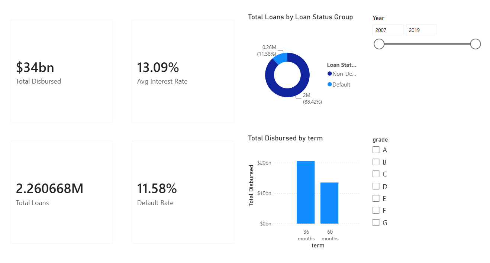
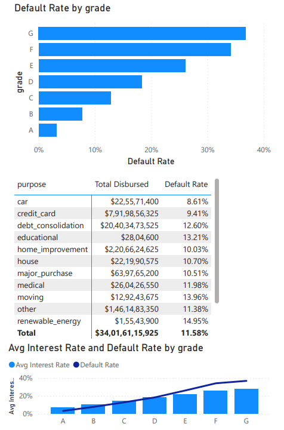
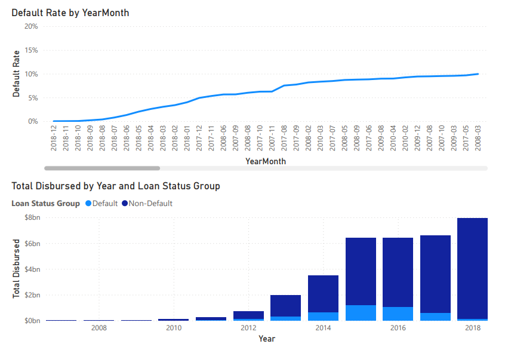
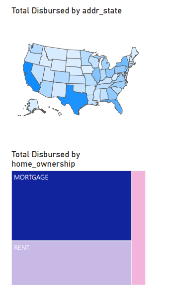

# 🏦 Loan Risk & Portfolio Analytics Dashboard (Power BI)

## 📌 Executive Summary
An end-to-end Power BI analytics solution built to evaluate credit risk, default rates, origination trends, and portfolio concentration across loan categories.

## 📊 Dashboard Walkthrough

### 1. Executive Overview


### 2. Risk Segmentation


### 3. Delinquency & Vintage Trends


### 4. Portfolio Mix & Geography


---

## 🛠️ Key DAX Measures

```dax
// Default Rate
Default Rate = 
DIVIDE(
    CALCULATE(
        COUNTROWS(loan), 
        loan[Loan Status Group] = "Default"
    ),
    [Total Loans],
    0
)

// Total Disbursed
Total Disbursed = SUM(loan[loan_amnt])

// Average Interest Rate
Avg Interest Rate = AVERAGE(loan[int_rate]) / 100
